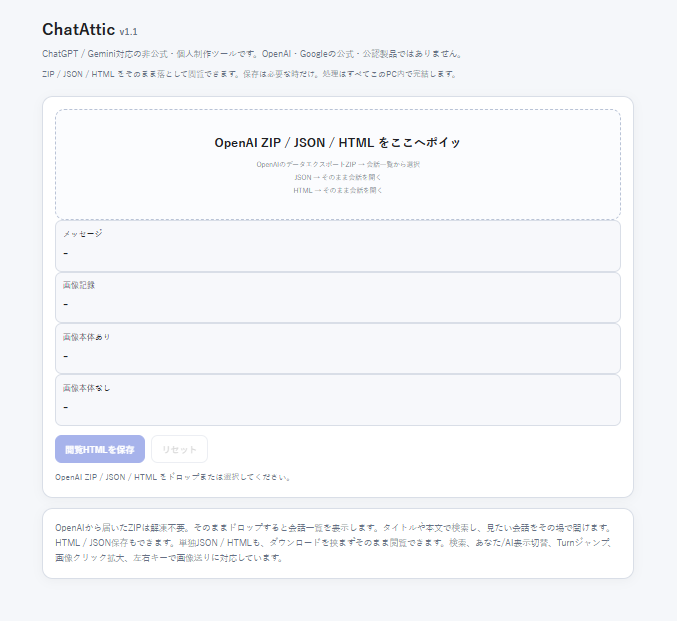
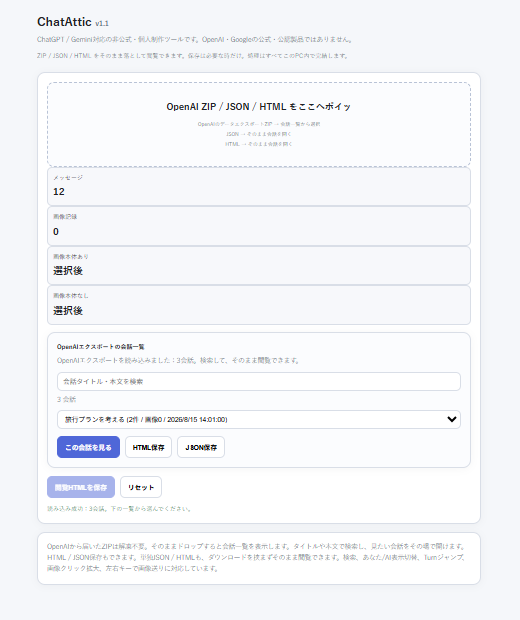
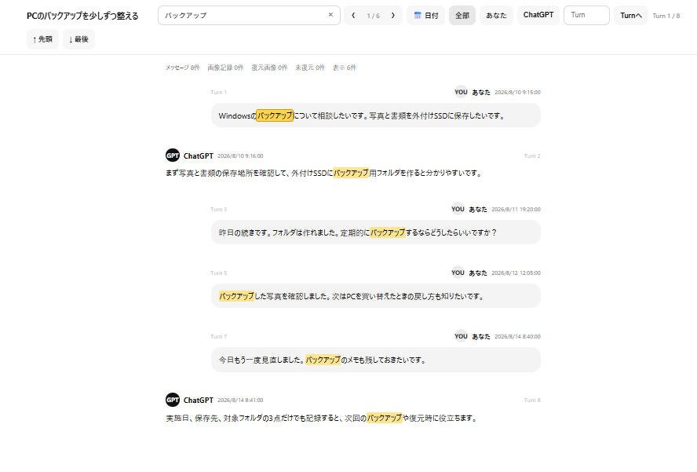

# ChatAttic

**ChatGPT / Geminiの会話を、保存して、探して、あとから読む。**

ChatAtticは、ChatGPT / Geminiの会話を保存・検索・閲覧するために作った、Chrome向けの非公式・個人制作ツールです。

OpenAIからエクスポートした ZIP / JSON / HTML も、PC上で読み込んで閲覧できます。

## スクリーンショット

### ChatAttic

ファイルをドラッグ＆ドロップして読み込めます。

### OpenAIエクスポートZIP / JSONを読み込み

OpenAIからエクスポートしたZIPは、解凍せずそのまま読み込めます。  
JSONを単体で読み込むこともできます。

複数の会話が含まれている場合は、検索して読みたい会話を選択できます。

### 会話ビューア

会話本文の検索、検索結果の前後移動、日付範囲や発言者による絞り込みができます。

## なぜ作ったか

短い会話なら、ブラウザのPDF保存やHTML保存でも十分です。

ただ、長い会話では途中が空白になるなど、うまく保存できないことがありました。

そこで、ChatGPT / Geminiの会話を保存して、あとから検索しながら読み返せるように **ChatAttic** を作りました。

## 主な機能

- 表示中のChatGPT / Gemini会話を保存
- ChatGPT / Geminiを自動判定
- 1つの拡張機能で両方に対応
- OpenAIエクスポートZIPを解凍せず閲覧
- OpenAIエクスポートJSONを読み込んで閲覧
- ChatAtticで保存したJSONを読み込んで閲覧
- HTMLを読み込んで閲覧
- 会話内の文字検索
- 検索結果の前後移動
- 日付範囲での絞り込み
- 発言者による表示の絞り込み
- Turn単位での移動
- 画像を含む保存データの閲覧
- 画像の拡大表示、左右キーによる画像送り

## ダウンロード

### ChatAttic v1.1

➡️ [ChatAttic_v1.1.zip をダウンロード](ChatAttic_v1.1.zip)

初めて試す場合は、下のサンプルデータも利用できます。

➡️ [ChatAttic_サンプル.zip をダウンロード](ChatAttic_サンプル.zip)

## インストール

1. `ChatAttic_v1.1.zip` を任意の場所へ解凍します。
2. Chromeで「拡張機能を管理」を開きます。
3. 右上の「デベロッパー モード」をオンにします。
4. 「パッケージ化されていない拡張機能を読み込む」を押します。
5. 解凍した `ChatAttic_v1.1` フォルダを選択します。
6. 必要に応じてChatAtticをツールバーへピン留めしてください。

※ v1.1はChromeでの利用を基本としています。

## 表示中の会話を保存する

1. ChatGPTまたはGeminiで保存したい会話を開きます。
2. 大量の会話を保存する場合は、一度先頭までスクロールして読み込み、最新の会話（下部）へ戻してから保存してください。
3. ChatAtticの拡張機能アイコンを押します。
4. 「会話を保存」を実行します。
5. 表示位置から上方向へ自動捕獲します。
6. 捕獲完了後、JSONを保存し、ChatAtticのアーカイブ画面を開きます。

※ 会話量やPC環境によって、読み込み・捕獲に時間がかかる場合があります。

## OpenAI ZIP / JSON / HTMLを見る

ChatAtticの入口画面を開き、中央の読み込みエリアへファイルをドラッグ＆ドロップします。

OpenAIエクスポートZIPは解凍不要です。

OpenAIエクスポートJSONを単体で読み込むこともできます。

ZIP / JSON内に複数の会話がある場合は、会話一覧から読みたい会話を選択して開けます。

ChatAtticで保存したJSONやHTMLも、そのまま読み込んで閲覧できます。

## ビューアの使い方

- **会話を検索**：会話本文を検索します。
- **‹ / ›**：検索結果の前後へ移動します。
- **日付**：日付で発言を絞り込みます。
- **全部 / あなた / ChatGPT / Gemini**：発言者で表示を絞り込みます。
- **Turn**：Turn単位で会話内を移動します。
- **先頭 / 最後**：会話の先頭・最後へ移動します。
- **画像クリック**：画像を拡大表示します。
- **← / →**：拡大表示中の画像を前後へ送ります。
- **Esc**：画像の拡大表示を閉じます。

## サンプルデータ

`ChatAttic_サンプル.zip` は、すべて架空の会話で作ったデモ用データです。

実際のChatGPTデータを使わずに、

- ZIPの読み込み
- 会話の選択
- 本文検索
- 日付による絞り込み

などを試すことができます。

ZIPは解凍せず、そのままChatAtticへドラッグ＆ドロップしてください。

## データと安全性

OpenAIエクスポートZIP / JSON / HTMLの閲覧処理はPC内で行います。

読み込んだHTMLについては、`script` / `iframe` などの実行要素や、外部HTTP/HTTPSリソースを遮断する対策を入れています。

巨大なZIPについても、安全のため読み込みサイズに上限を設けています。

## 使用する権限

- `scripting`  
  ChatGPT / Gemini画面で会話保存処理を実行するために使用します。

- `https://chatgpt.com/*`  
  ChatGPT上で会話保存処理を動かすために使用します。

- `https://gemini.google.com/*`  
  Gemini上で会話保存処理を動かすために使用します。

## アンインストール

Chromeの「拡張機能を管理」からChatAtticの「削除」を押してください。

解凍したChatAtticフォルダが不要であれば、その後削除できます。

## 非公式ツールについて

ChatAtticは個人制作の非公式ツールです。

OpenAI・Googleによる公式・公認・提携製品ではありません。

ChatGPT、OpenAI、Gemini、Googleの名称は、それぞれの権利者に帰属します。

---

**ChatAttic v1.1 — ChatGPT / Gemini対応**
